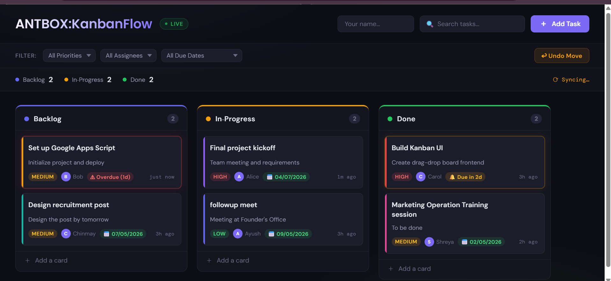
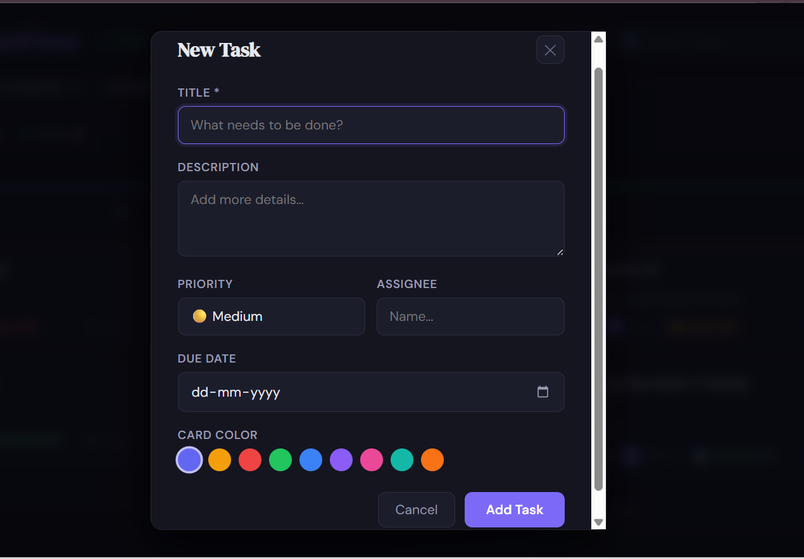
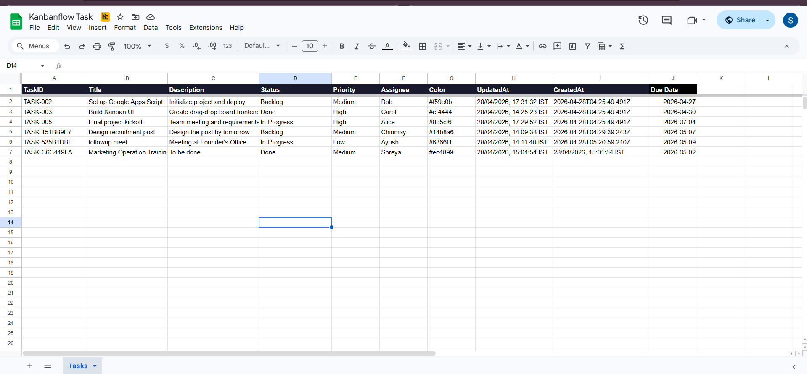
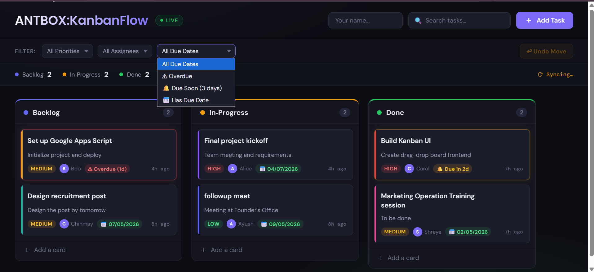

#  KanbanFlow — Real-Time Collaborative Kanban Board

Website Link: https://script.google.com/a/macros/kiit.ac.in/s/AKfycbwvFjfdQQeDjr2BecUgKk4_tenDOPMCx9RrChKqljf1jYRcyFDikgwHD9yeuhIbtdI49g/exec
Example Excel Link: https://docs.google.com/spreadsheets/d/1pcACiOcuAMHgkRNUmIvumFSURAlABq7y_CT-F_arwEc/edit?usp=sharing

A fully collaborative Kanban board built using **Google Apps Script + Google Sheets**, enabling multiple users to manage tasks in real-time with seamless sync and zero page refresh.

---

##  Features

*  Real-time sync (~3s polling with hash detection)
*  Drag & Drop (Sortable.js)
*  Optimistic UI (instant feedback)
*  Due Dates + Overdue Highlight
*  Advanced Filters (Priority, Assignee, Due Date)
*  Undo Last Move (Ctrl+Z)
*  Color-coded Cards
*  Toast Notifications
*  User Tagging (localStorage)
*  Fully Responsive UI

---

##  Screenshots

###  Main Board



###  Add Task Modal



### Excel Sheet view



### Due Date Highlight




---

##  Architecture

```
Frontend (HTML/CSS/JS)
        ↓ google.script.run
Google Apps Script (Backend)
        ↓
Google Sheets (Database)
```

---

##  Real-Time Flow

```
Drag Task 
→ Optimistic UI Update 
→ API Call (updateTask) 
→ LockService (prevent conflicts) 
→ Update Sheet 
→ Poll detects change 
→ Re-render for all users
```

---

##  Tech Stack

* **Frontend:** HTML, CSS, Vanilla JavaScript
* **Backend:** Google Apps Script
* **Database:** Google Sheets
* **Drag & Drop:** Sortable.js
* **Concurrency Control:** LockService

---

##  Setup & Deployment

```
Create Google Sheet (copy Sheet ID) 
→ Setup GAS Project 
→ Add Code.gs + index.html 
→ Authorize Script (run getTasks) 
→ Deploy as Web App 
→ Copy /exec URL 
→ Share with users → Live Sync
```

---

##  Key Engineering Concepts

* **Hash-based change detection** → prevents unnecessary re-renders
* **Optimistic UI updates** → instant UX without waiting for backend
* **LockService concurrency control** → avoids race conditions
* **Client-side filtering** → zero extra API calls
* **Polling architecture** → simulates real-time without WebSockets

---

##  Project Structure

```
KanbanFlow/
├── Code.gs
├── index.html
├── README.md
└── screenshots/
```

---

##  Configuration

Before running the project, update your Sheet ID in `Code.gs`:

```javascript
var SHEET_ID = "YOUR_SHEET_ID_HERE";
```

---

##  Live Demo

 Add your deployed Web App URL here
Example:

```
https://script.google.com/macros/s/YOUR_DEPLOYMENT_ID/exec
```

---

##  Future Improvements

* WebSocket-based real-time sync (via proxy server)
* Authentication & user roles
* Activity logs / audit history
* Notifications system
* Task comments & attachments

---

##  Author

**Saaksshi Podder**

---

## ⭐ Support

If you like this project, consider giving it a ⭐ on GitHub!
